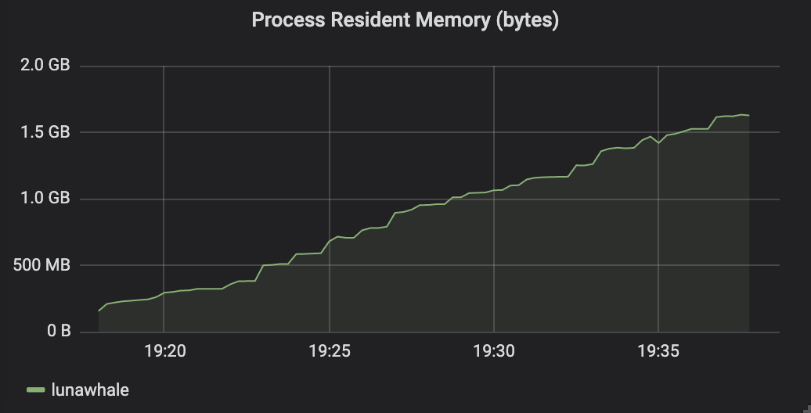
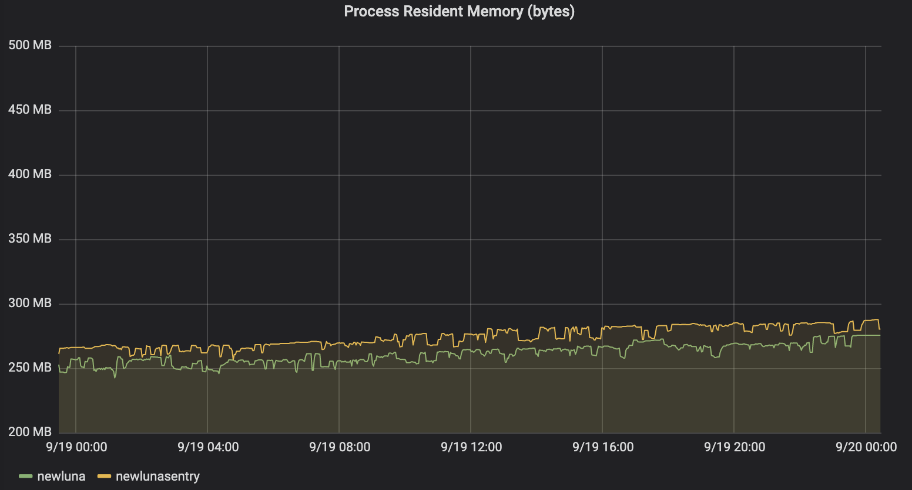
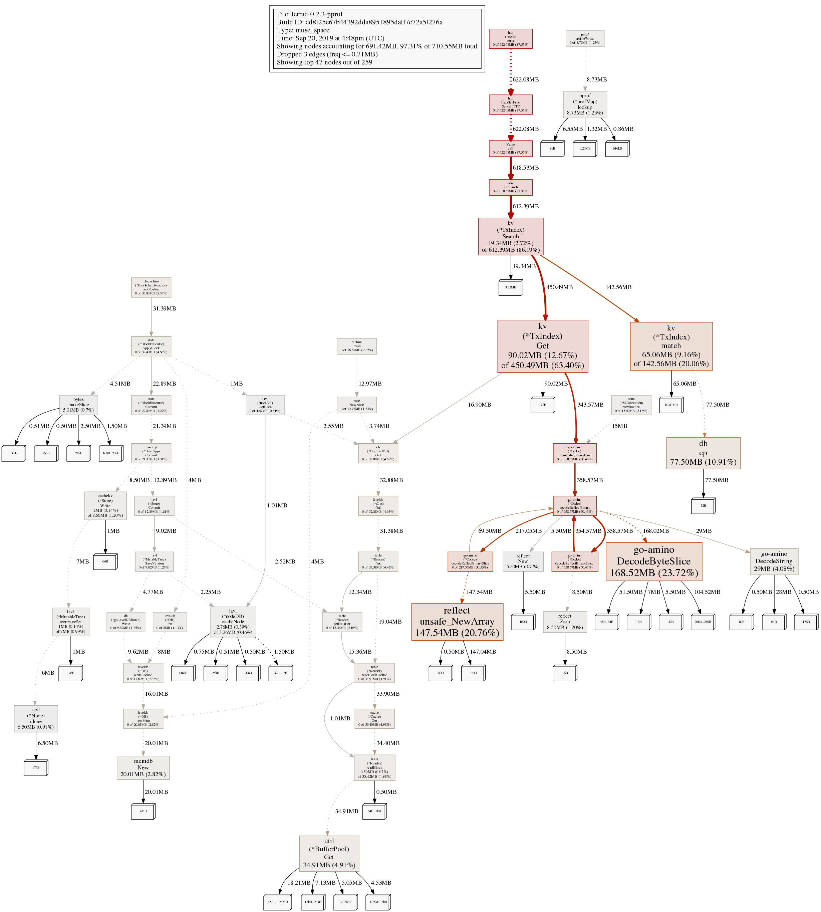

# Cosmos의 rest server 및 go-amino 패키지의 메모리 사용량 이슈

안녕하세요. dsrv labs입니다.

dsrv labs는 Terra Validator노드를 돌리고 있습니다.
그와 더불어 Terra 관련 서비스를 구현하기 위하여 Validator노드가 아닌 일반 노드도 운영하고 있습니다. 

오늘은 서비스를 제공하기 위한 Terra의 Rest Server 관련된 이야기를 하려고 합니다.

## Cosmos와 Terra의 Rest Server

Cosmos SDK는 노드와 별개의 Process로 동작하는 [Rest Server](https://cosmos.network/docs/clients/service-providers.html#setting-up-the-rest-server)를 제공하고 있습니다. 
Rest Server는 외부의 요청을 받으면, RPC (Remote Procedure Call)을 이용하여 노드에게 요청을 보내 결과를 받아 외부에 돌려주는 역할을 담당하고 있습니다.
노드가 외부의 요청을 직접적으로 받지 않고 별도의 Process로 동작하는 Rest Server가 외부의 요청을 받도록하여 노드가 더욱 안정적으로 동작할 수 있게됩니다.

그리고 Cosmos SDK를 이용하여 구현된 Terra도 `terracli`를 통하여 Rest Server를 [Light Client Daemon](https://docs.terra.money/guide/light-client)으로 제공하고 있습니다.

dsrv labs에서 제공하는 서비스 중 하나인 [Luna Whale](https://www.lunawhale.com/)의 일부 서비스는 Terra의 Rest Server를 활용하여 구현되어 있습니다.

## Rest Server는 살아있는데 노드가 죽었다? 

어느 날 저희가 서비스를 구현하기 위하여 동작시키고 있던 Terra 노드가 아래와 같은 메모리 사용량을 보이면서 소위 OOM (out of memory)으로 의도하지 않게 종료되었습니다.

Rest Server는 정상적으로 동작하고 있었으며, 노드만 메모리 부족으로 종료되었습니다.

dsrv labs에서 운영중인 Terra Validator 노드에서 위 시간이 포함된 24시간 기록을 살펴보니, 아래와 같이  일정한 메모리 사용량을 보여주고 있었습니다.

## 메모리 사용량은 왜 늘었을까?

메모리 사용량이 단시간 내에 갑자기 늘었으므로, 처음에는 Terra 블록체인 처리를 위하여 메모리가 늘었을 것으로 생각하였습니다.
하지만 Validator 노드와 다른 Terra node의 메모리 사용량은 큰 변화를 보이지 않아 Terra 블록체인 때문은 아닌 것으로 판단하였습니다.

문제 재현을 위하여 해당 노드를 다시 시작한 후 메모리 프로파일링을 병행하며 메모리 사용량을 확인해 보았습니다.

그랬더니 아래와 같은 프로파일링 결과가 나왔습니다.

## Rest call 이 많은 메모리를 사용하고 있다!

위 프로파일링 결과의 제일 위를 살펴보면, Rest Server가 노드에게 보낸 요청을 처리하는 과정에서 600MB 이상의 메모리를 점유하며 사용하고 있는 것이 보입니다.

그리고 그 처리 과정 중 `go-amino` 패키지에서 약 358MB의 메모리를 사용하고 있는 것을 확인 할 수 있습니다.

## go-amino 패키지란?

[go-amino](https://github.com/tendermint/go-amino)은 Tendermint에서 사용하고 있는 object encoding specification인 Amino의 go 구현체 패키지이다.

그리고 해당 `go-amino` repo에서 [go-amino#211](https://github.com/tendermint/go-amino/issues/211), [go-amino#254](https://github.com/tendermint/go-amino/issues/254)에서도 많은 메모리 사용량에 대한 issue가 있었다. 위 이슈들은 각각 decoding과 encoding에서의 많은 메모리 사욜양에 대한 내용을 이야기 하고 있었다.

우리 dsrv labs의 노드에서는 현재 decode 시에 많은 메모리가 사용된 현상이 관찰되고 있어 위 이슈와의 관련성이 있을 것으로 예상되었습니다.

(TBD)

## 결론?
(TBD)
