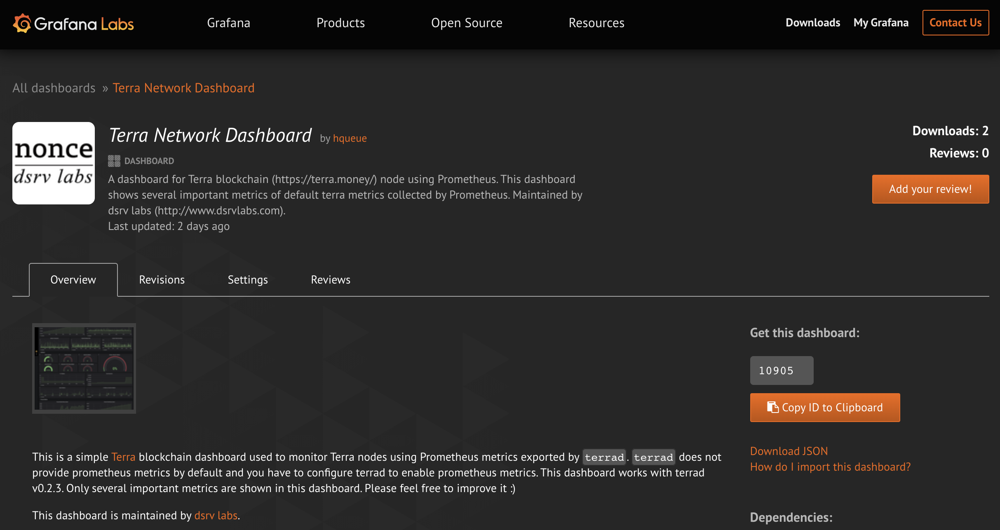
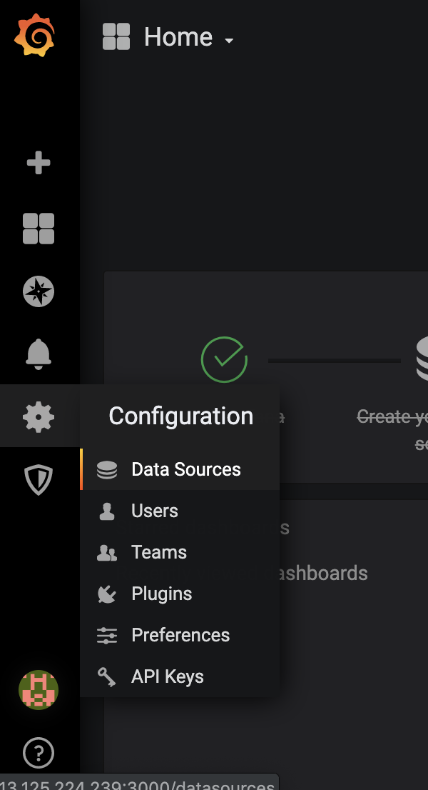
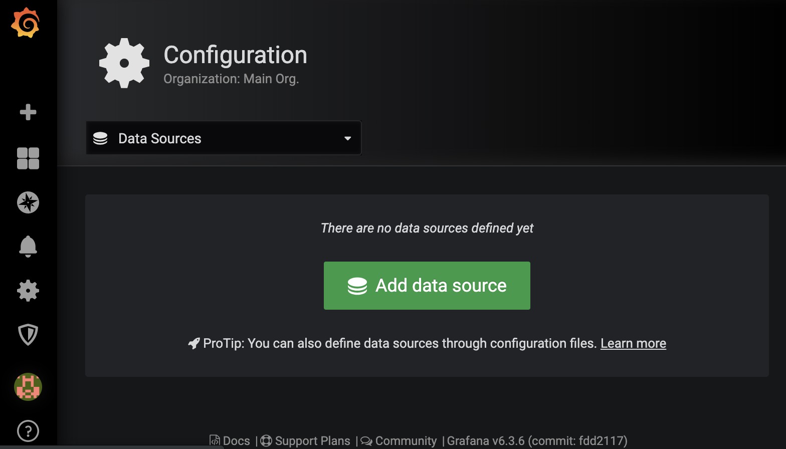
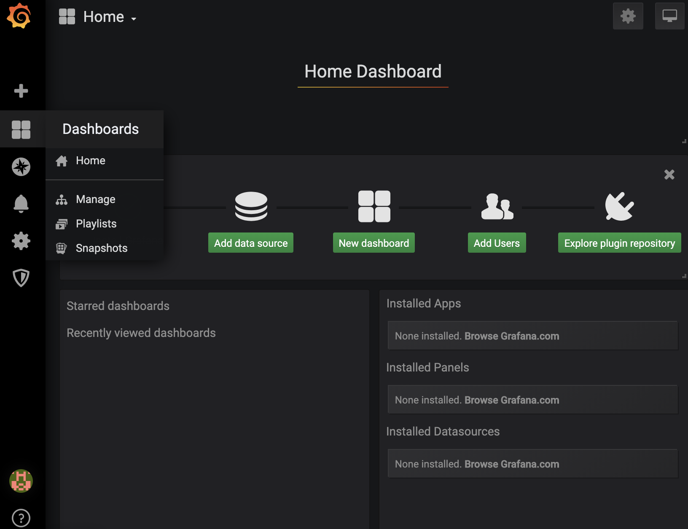
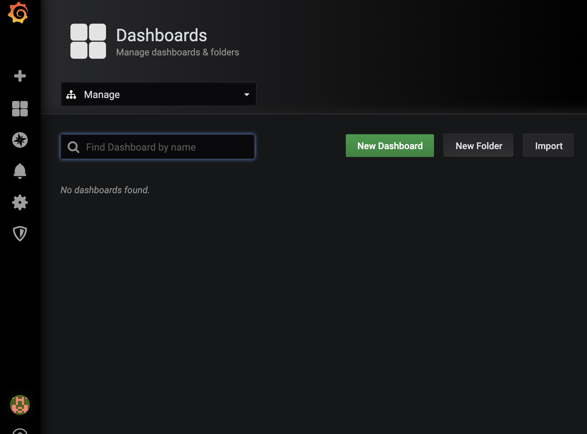
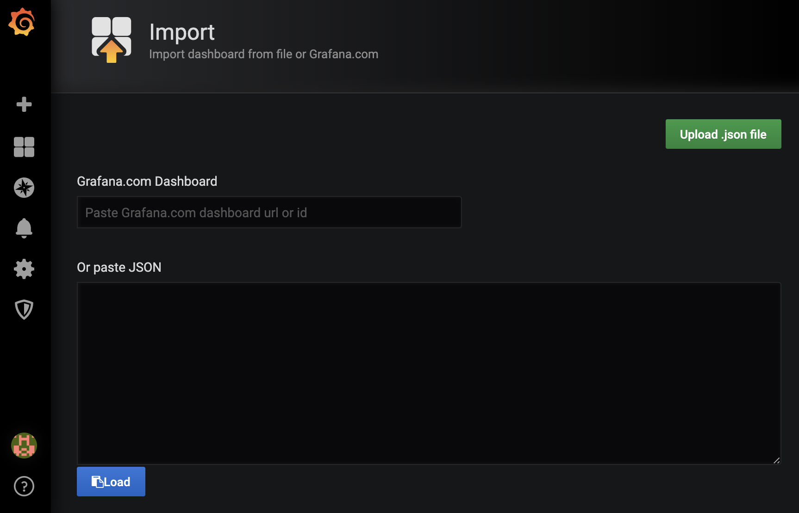

## Exploit docker to conveniently setup monitoring for Terra nodes

Hello, this is dsrv labs.

[dsrv labs](https://www.dsrvlabs.com/) runs several Terra nodes including a Terra validator node, i.e. [nonce - LunaWhale.com](https://terra.stake.id/#/validator/884C3AFE32027177FFB522403654223B4587F60E).
In addition to nodes, we setup monitoring and alerting system for Terra nodes to manage those nodes more efficiently.

We also created a template of Grafana dashboard for Terra node
at https://grafana.com/grafana/dashboards/10905 as below.


This article will describe how to setup simple monitoring/alerting system for Terra nodes conveniently using [Prometheus](https://prometheus.io/) and [Grafana](https://grafana.com/) by exploiting [Docker](https://www.docker.com/) and [Terra Network Dashboard](https://grafana.com/grafana/dashboards/10905).

This article is for readers who have not setup monitoring system using Prometheus and Grafana before and helps to start monitoring Terra node.

## Pre-requisite

- A monitoring server for Prometheus and Grafana
- docker installed on monitoring server

We strongly recommend you to prepare another server for monitoring.
Of course, your monitoring system can use same machine with Terra node, but it would be unreliable.

This article assumes docker is installed on your monitoring server.
If docker is not available yet, please install docker.

If you are using Amazon Linux 2 on AWS instance, you can find instructions to install docker at [Installing Docker on Amazon Linux 2](https://docs.aws.amazon.com/AmazonECS/latest/developerguide/docker-basics.html#install_docker).

For other environment, please visit https://docs.docker.com/install/.

## Configure and restart Terra node for monitoring

Terra node provides Prometheus metrics but this feature is not enabled by default.

Edit configuration file of Terra node, e.g. `config.toml`, as below.
`config.toml` is usually located at `~/.terrad/config/config.toml`.

```
# When true, Prometheus metrics are served under /metrics on
# PrometheusListenAddr.
# Check out the documentation for the list of available metrics.
prometheus = true

# Address to listen for Prometheus collector(s) connections
prometheus_listen_addr = ":26660"
```
Above `config.toml` enables Terra node to export metrics for Prometheus using port `26660`.

After configuring Terra node, please restart your terra node.

## Start Prometheus server

First we have to prepare configuration file, e.g. `~/prometheus/prometheus.yml`, for Prometheus.

Let's create a prometheus directory and a `prometheus.yml` file.
```
$ mkdir ~/prometheus/
```

And an example of `prometheus.yml` is as below.

```
global:
  scrape_interval:     15s # By default, scrape targets every 15 seconds.

  # Attach these labels to any time series or alerts when communicating with
  # external systems (federation, remote storage, Alertmanager).
  external_labels:
    monitor: 'codelab-monitor'

# A scrape configuration containing exactly one endpoint to scrape:
# Here it's Prometheus itself.
scrape_configs:
  # The job name is added as a label `job=<job_name>` to any timeseries scraped from this config.

  # Example jobs: prometheus self
  #  #  - job_name: 'prometheus'
  #
  #    # Override the global default and scrape targets from this job every 5 seconds.
  #    scrape_interval: 5s
  #
  #    static_configs:
  #      - targets: ['localhost:9090']
  #
  - job_name: 'terra'

    # Override the global default and scrape targets from this job every 5 seconds.
    scrape_interval: 5s

    static_configs:
      - targets: ['UUU.XXX.YYY.ZZZ:26660']    # Terra node
        labels:
          hostname: 'lunawhale'
```

You have to edit `targets` at the end with IP address and Prometheus port of your Terra node.

`hostname` is a label to identify target easily later at Grafana dashboard and you can use your own name for `hostname`.

We created `~/prometheus/prometheus.yml` and your file system may look like below.

```
$ cd ~
$ $ tree
.
└── prometheus
    └── prometheus.yml
```

Now you can start Prometheus daemon with a following command.
```
$ docker run -d  --name=prometheus-terra -p 9090:9090 -v ~/prometheus/prometheus.yml:/prometheus/prometheus.yml prom/prometheus --config.file=/prometheus/prometheus.yml
```

If Prometheus started without problem, you can check it with below command.
```
$ docker ps
CONTAINER ID        IMAGE               COMMAND                  CREATED             STATUS              PORTS                    NAMES
891492b3c2e5        prom/prometheus     "/bin/prometheus --c…"   2 seconds ago       Up 1 second         0.0.0.0:9090->9090/tcp   prometheus-terra
```

## Start Grafana server

You can start Garafana using below command without configuration, because we will configure grafana using GUI later.
```
$ docker run -d --name=grafana-terra -p 3000:3000 grafana/grafana
```
This command will start Grafana and Grafana service will be provided at port 3000.

## Connect Grafana to Prometheus

Now let's connect to Grafana using your preferred web browser by connecting to `http://<IP address of Grafana server>:3000/`.


> If you can't connect to Grafana server, please make sure port, i.e. 3000 in this article, for Granana is allowed to accept incoming traffic from your computer.

You can login to Grafana with ID `admin` and password `admin`.

<p align="center">

</p>

After login, click `Data Sources` in `Configuration` of left menu.



Click "Add data source".


Choose "Prometheus".


Please put URL of your Prometheus server information and press `Save and Test` button below.
If it works, it will shows "Data source is working" as above.

Now we have added Prometheus as data source to Grafana.

## Setup dashboard for Terra node

Let's setup dashboard to monitor Terra node using template we prepared.

Please visit https://grafana.com/grafana/dashboards/10905 to download a template for Terra node monitoring as below.


Press `Download JSON` to download a JSON file.


Now come back to Grafana page and choose `Manage` in `Dashboards` menu as below.


Choose `Import` to use a downloaded `JSON` file.



Choose `Update .json file` to upload a downloaded `JSON` file.



In below screen, you can set name of dashboard and choose data source we just setup in above. Then press `import` button to finish the setup.


Now you can see a dashboard like below one.


> If no metric is shown, then please check port for Prometheus, i.e. `prometheus_listen_addr` 26660 in above `config.toml` of Terra node, is accessible from Prometheus server.

## Setup alerting

You can also add alert to any metrics by configuring each panel.

For example, let's click `Liveness` panel and choose `Edit` as below.

<p align="center">

</p>

Choose `Alert` in the left menu, i.e. bell-like icon, and you can add alert and this alert can send notification to various channel, such as Email, Slack, Discord and etc.

<p align="center">

</p>

For more information, please visit official [Grafana Alerting](https://grafana.com/docs/alerting/rules/) document.

## Wrap up

This article shows how to setup a monitoring system using Prometheus and Grafana with ease by exploiting Docker.

Although this monitoring system is very naive and simple, we hope this helps you to start setting up a well-structured monitoring system for your Terra node.

[dsrv labs](https://www.dsrvlabs.com) will update [Terra Network Dashboard Template](https://grafana.com/grafana/dashboards/10905) continuously.

## References
(TBD)
